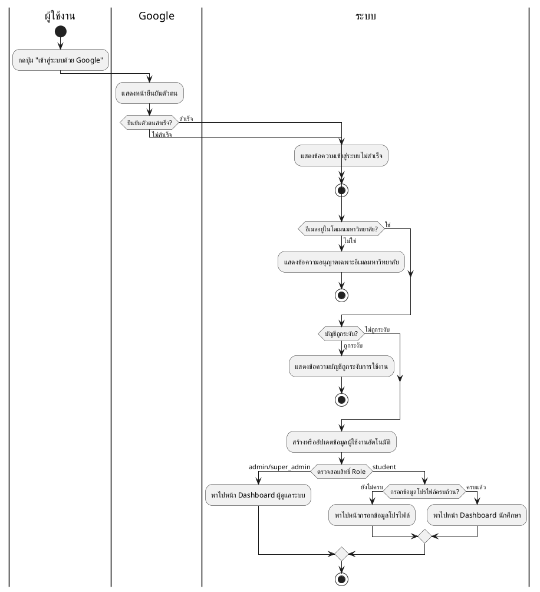
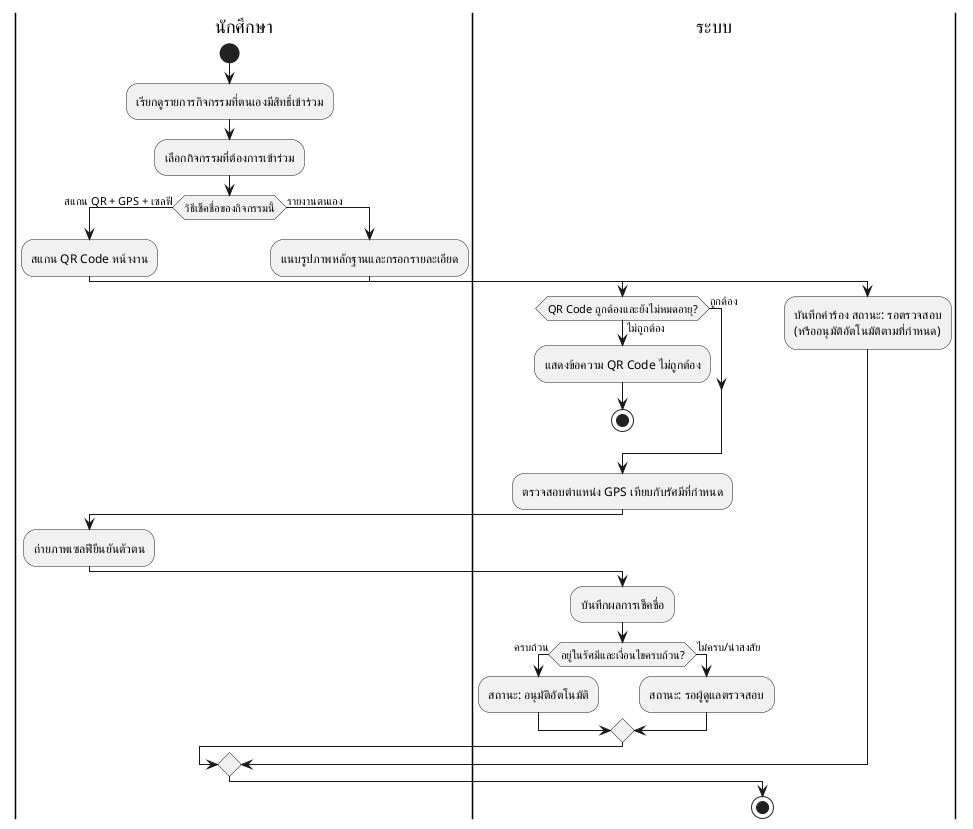
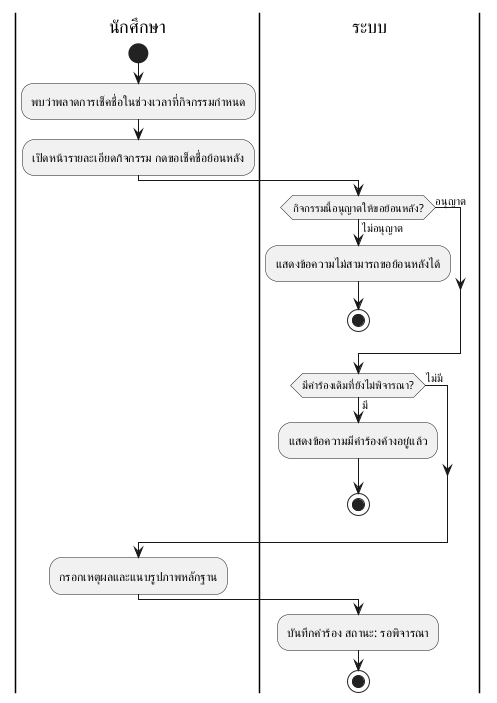
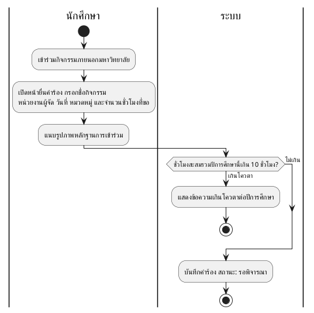
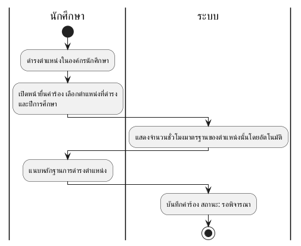
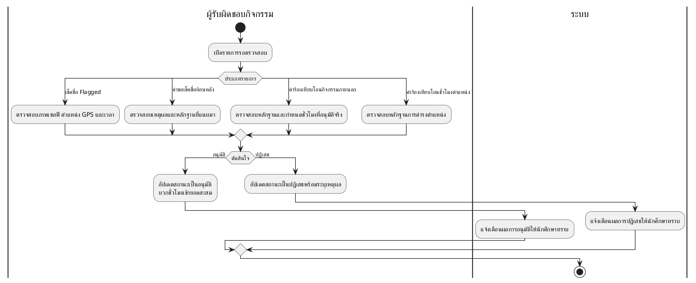
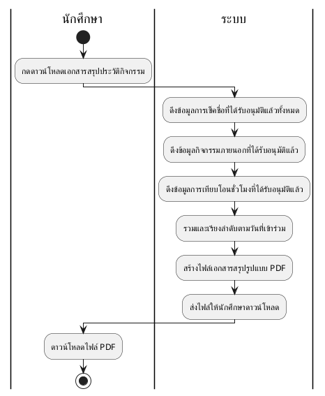
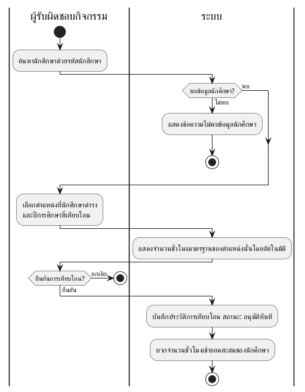

# Activity Diagram ทั้ง 9 ระบบงานหลัก (แบบ Swimlane — PlantUML)

วางโค้ดแต่ละอันที่ https://www.plantuml.com/plantuml/uml/ หรือ https://planttext.com แล้ว export เป็นรูปภาพ (PNG/SVG) เพื่อนำไปแปะในเอกสารแทนภาพที่ 5-13 — รูปแบบ Swimlane นี้ตรงกับมาตรฐาน UML Activity Diagram (แบ่งคอลัมน์ตามผู้รับผิดชอบแต่ละขั้นตอน)

## ภาพที่ 5 — ระบบตรวจสอบสิทธิ์และการเข้าสู่ระบบ (Login)



## ภาพที่ 6 — ระบบการสร้างและจัดการกิจกรรม

```plantuml
@startuml
|ผู้รับผิดชอบกิจกรรม|
start
:เปิดฟอร์มสร้างกิจกรรมใหม่;
:กรอกชื่อ รายละเอียด ระดับกิจกรรม
หมวดหมู่ ลักษณะกิจกรรม วันเวลา;
:ปักหมุดสถานที่จัดกิจกรรมบนแผนที่
และกำหนดรัศมีพื้นที่เช็คชื่อ;
|ระบบ|
if (ข้อมูลครบถ้วนถูกต้อง?) then (ไม่ถูกต้อง)
  :แสดงข้อความแจ้งเตือนให้แก้ไขข้อมูล;
  |ผู้รับผิดชอบกิจกรรม|
  backward:แก้ไขข้อมูล;
else (ถูกต้อง)
endif
|ระบบ|
:บันทึกกิจกรรมลงฐานข้อมูล;
:สร้างรหัสกิจกรรมและรหัสลับสำหรับ QR Code;
if (สถานะกิจกรรมเป็นเปิดรับสมัคร?) then (เปิดรับ)
  :แจ้งเตือนนักศึกษาที่มีสิทธิ์เข้าร่วม;
  |นักศึกษา|
  :ได้รับการแจ้งเตือน;
else (ร่าง/ไม่เปิดรับ)
  |ระบบ|
  :บันทึกเป็นฉบับร่าง;
endif
stop
@enduml
```

## ภาพที่ 7 — ระบบเรียกดูและเช็คชื่อเข้าร่วมกิจกรรม



## ภาพที่ 8 — ระบบยื่นคำขอเช็คชื่อย้อนหลัง



## ภาพที่ 9 — ระบบยื่นคำร้องขอเทียบโอนชั่วโมงกิจกรรมภายนอก



## ภาพที่ 10 — ระบบยื่นคำร้องขอเทียบโอนชั่วโมงตำแหน่ง



## ภาพที่ 11 — ระบบการพิจารณาอนุมัติคำร้องต่าง ๆ



## ภาพที่ 12 — ระบบสร้างเอกสารสรุปผลกิจกรรม



## ภาพที่ 13 — ระบบเทียบโอนชั่วโมงกิจกรรมโดยตรง (Admin Grant)


