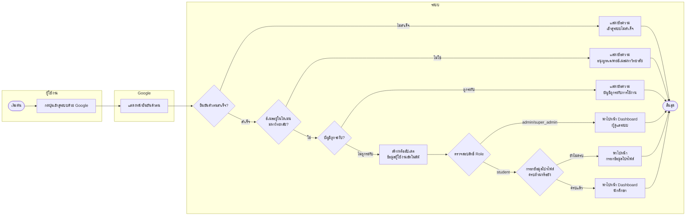
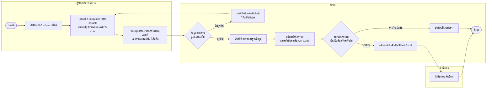
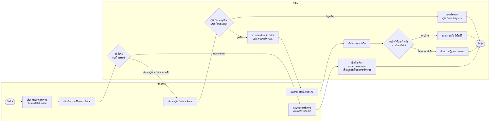
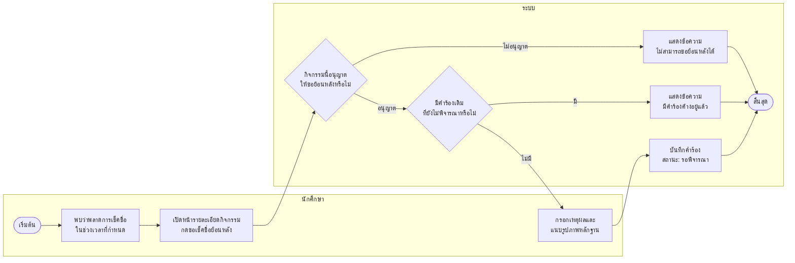
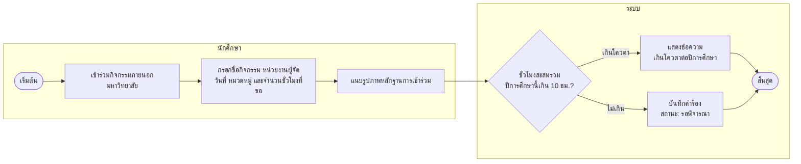
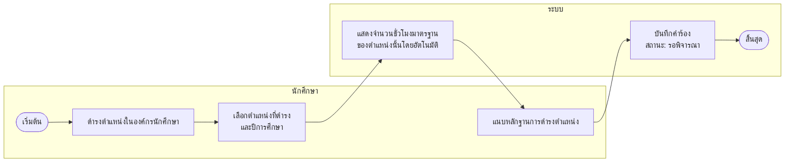
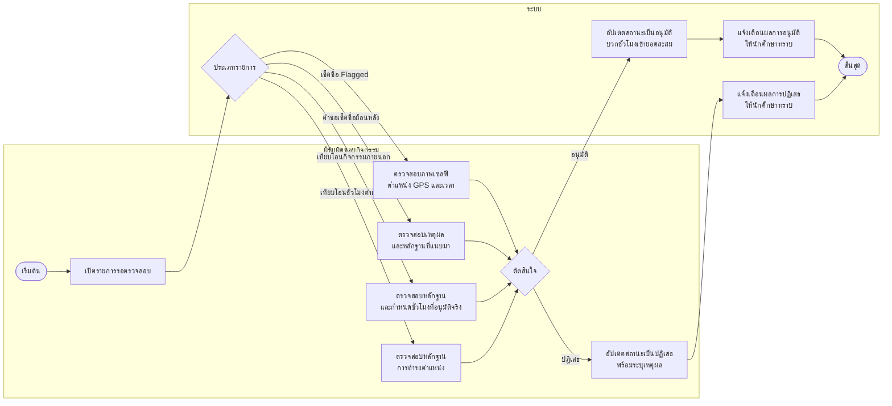
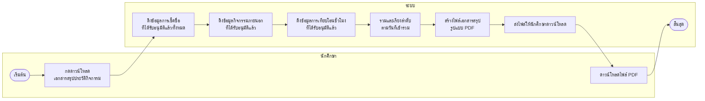
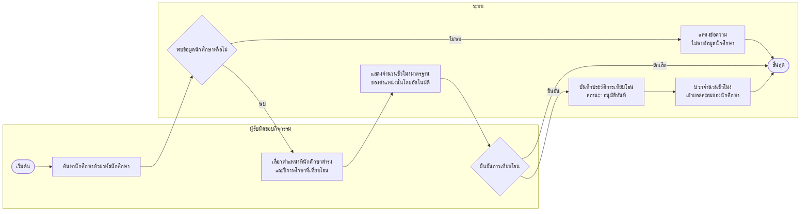

# Activity Diagram ทั้ง 9 ระบบงานหลัก (แบบ Swimlane — Mermaid)

PlantUML server สาธารณะไม่รองรับฟอนต์ภาษาไทย (ขึ้นเป็นกล่องสี่เหลี่ยม/ตัวอักษรขาดหาย) จึงกลับมาใช้ Mermaid ซึ่งเรนเดอร์ภาษาไทยได้ปกติ โดยจำลอง Swimlane ด้วย `subgraph` แยกคอลัมน์ตามผู้รับผิดชอบแต่ละขั้นตอน — วางโค้ดแต่ละอันที่ https://mermaid.live แล้ว export เป็นรูปภาพเพื่อนำไปแปะแทนภาพที่ 5-13

## ภาพที่ 5 — ระบบตรวจสอบสิทธิ์และการเข้าสู่ระบบ (Login)

## ภาพที่ 6 — ระบบการสร้างและจัดการกิจกรรม

## ภาพที่ 7 — ระบบเรียกดูและเช็คชื่อเข้าร่วมกิจกรรม

## ภาพที่ 8 — ระบบยื่นคำขอเช็คชื่อย้อนหลัง

## ภาพที่ 9 — ระบบยื่นคำร้องขอเทียบโอนชั่วโมงกิจกรรมภายนอก

## ภาพที่ 10 — ระบบยื่นคำร้องขอเทียบโอนชั่วโมงตำแหน่ง

## ภาพที่ 11 — ระบบการพิจารณาอนุมัติคำร้องต่าง ๆ

## ภาพที่ 12 — ระบบสร้างเอกสารสรุปผลกิจกรรม

## ภาพที่ 13 — ระบบเทียบโอนชั่วโมงกิจกรรมโดยตรง (Admin Grant)

